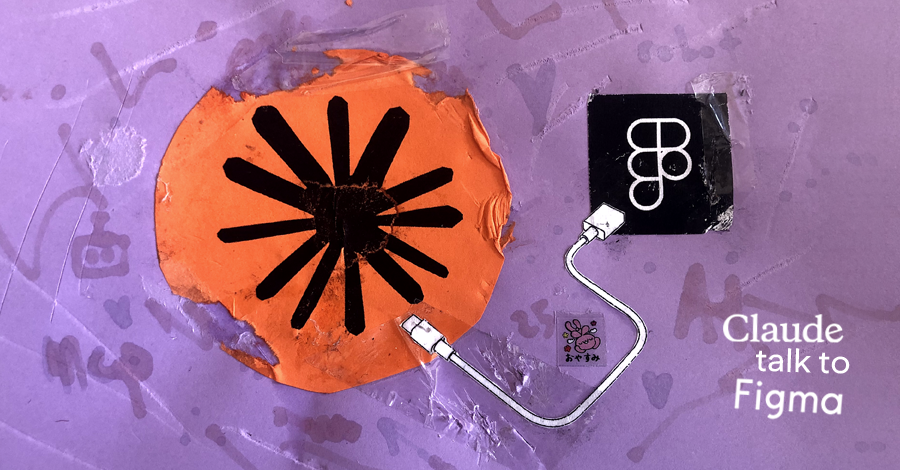

# <del>Claude</del> <ins>AI Agents</ins> Talk to Figma MCP

Enable your AI agents to read, analyze, and modify Figma designs.

From your favorite agentic tool:

- [Claude Desktop](https://claude.ai/download)
- [Claude Code](https://docs.anthropic.com/en/docs/claude-code)
- [Cursor](https://cursor.com/downloads)
- [Windsurf](https://windsurf.com/download)
- [VS Code](https://code.visualstudio.com/) + [GitHub Copilot](https://github.com/features/copilot)
- [Cline](https://marketplace.visualstudio.com/items?itemName=saoudrizwan.claude-dev)
- [Roo Code](https://marketplace.visualstudio.com/items?itemName=RooVeterinaryInc.roo-cline)

## 👩🏽‍💻 Who it's for

### UX/UI Teams

Automate repetitive design tasks and maintain brand consistency without manual effort:

- **Automated accessibility audits** - Detect and fix contrast issues in seconds
- **Bulk style updates** - Change colors, typography, or spacing across the entire document with a single command
- **Visual hierarchy analysis** - Get instant feedback on your design structure

### Developers

Generate production-ready code directly from designs:

- **React/Vue/SwiftUI components** - From design to code in one step
- **Code with design tokens** - Keep design and development in sync
- **Reduce handoff friction** - Fewer back-and-forth iterations with the design team

> **Key advantage**: Unlike [Figma's official MCP](https://www.figma.com/mcp-catalog/) which requires a Dev Mode license, this MCP **works with any Figma account** (even free ones).

## 💡 Real-world use cases

**Accessibility:**
> "Find all text with contrast ratio <4.5:1 and suggest colors that meet WCAG AA"

**Rebranding:**
> "Change #FF6B6B to #E63946 in all primary buttons throughout the document"

**Design analysis:**
> "Analyze the visual hierarchy of this screen and suggest improvements based on design principles"

**Developer handoff:**
> "Generate the React component for 'CardProduct' including PropTypes and styles in CSS modules"

## ⚡️ Quick installation

**Setup:** 5 minutes | **First automation:** 2 minutes

### Requirements

- [Node.js](https://nodejs.org/en/download) installed
- [Figma Desktop](https://www.figma.com/downloads/)
- AI client:
  - [Claude Desktop](https://claude.ai/download)
  - [Claude Code](https://docs.anthropic.com/en/docs/claude-code)
  - [Cursor](https://cursor.com/downloads)
  - [Windsurf](https://windsurf.com/download)
  - [VS Code](https://code.visualstudio.com/) + [GitHub Copilot](https://github.com/features/copilot)
  - [Cline](https://marketplace.visualstudio.com/items?itemName=saoudrizwan.claude-dev)
  - [Roo Code](https://marketplace.visualstudio.com/items?itemName=RooVeterinaryInc.roo-cline)

### Step 1: Install and start the websocket

*Enables the Agent to send commands to Figma.*

Open your terminal, navigate to the folder where you want to install the tool, and run:

```bash
npx claude-talk-to-figma-mcp
```

> **💡 Tip**: This command is an "all-in-one" (clones, installs, and starts). In subsequent sessions, if you're already inside the project folder `your-project/claude-talk-to-figma-mcp`, you can simply run `bun run socket`.

### Step 2: Install the plugin in Figma

*Enables Figma to receive commands from the agent and return responses.*

In Figma Desktop go to Menu → Plugins → Development → Import plugin from manifest → inside the folder where you installed the MCP, select `src/claude_mcp_plugin/manifest.json`

### Step 3: Configure your Agentic Tool

*Enables the agent to use the MCP's read and modify tools.*

#### Claude Desktop

Download [claude-talk-to-figma-mcp.dxt](https://github.com/arinspunk/claude-talk-to-figma-mcp/releases) and double-click. Claude configures itself automatically.

#### Cursor

1. Open **Cursor Settings → Tools & Integrations**
2. Click **"New MCP Server"** to open the `mcp.json` file
3. Add this configuration:
  ```json
  {
    "mcpServers": {
      "ClaudeTalkToFigma": {
        "command": "npx",
        "args": ["-p", "claude-talk-to-figma-mcp@latest", "claude-talk-to-figma-mcp-server"]
      }
    }
  }
  ```
4. Save the file and restart Cursor

#### Other Agentic Tools

For other tools (Claude Code, Windsurf, VS Code + GitHub Copilot, Cline, Roo Code), you can follow the instructions in the ["Configure your Agentic Tool" chapter of the detailed installation guide](INSTALLATION.md#3-configure-your-agentic-tool).

### Step 4: Start working

1. Open the plugin in Figma
2. Copy the channel ID (bold code inside the green box)
3. Type in the chat: `Connect to Figma, channel {your-ID}`

✅ Ready to design with AI!

## Subsequent work sessions

To use the MCP again in day-to-day work, you don't need to repeat the entire process:

1. **Start the socket**: In the terminal, enter the project folder `your-project/claude-talk-to-figma-mcp` and run `bun run socket` (or `npm run socket`).
2. **Open the plugin in Figma**: You'll find it in your recent plugins list.
3. **Connect the AI**: Copy the channel ID and tell your agent: `Connect to Figma, channel {your-ID}`.

## 🛠️ Capabilities

**Design analysis**
- Get document information, current selection, styles
- Scan text, audit components, export assets

**Element creation**
- Shapes, text, frames with full style control
- Clone, group, organize elements

**Modification**
- Colors, borders, corners, shadows
- Auto-layout, advanced typography
- Local components and team library components

See [complete command list](COMMANDS.md).

## 📚 Documentation

- [Detailed installation](INSTALLATION.md) — Manual setup, Cursor, Windsurf and other IDEs
- [Available commands](COMMANDS.md) — Complete tool reference
- [Troubleshooting](TROUBLESHOOTING.md) — Common errors and how to fix them
- [Contributing](CONTRIBUTING.md) — Architecture, testing, contribution guide
- [Changelog](CHANGELOG.md) — Version history

## 🙏 Credits

Based on [cursor-talk-to-figma-mcp](https://github.com/sonnylazuardi/cursor-talk-to-figma-mcp) by Sonny Lazuardi. Adapted for Claude Desktop and extended with new tools by [Xúlio Zé](https://github.com/arinspunk).

If you want to know about all project contributions, you can visit the ["Contributors" chapter of the contribution guide](CONTRIBUTING.md#contributors).

[MIT License](LICENSE)

---

## 📊 Project status

✅ **Stable production** - Tool ready for daily use in design and development teams

🚀 **Under active development:**
- Complete support for Figma Variables
- Enhanced export to Tailwind CSS/SwiftUI

### Need something specific?

**[Propose new ones on GitHub Issues](https://github.com/arinspunk/claude-talk-to-figma-mcp/issues)**

Your feedback and contributions keep the project alive. ❤️